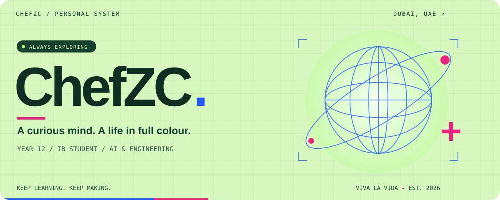
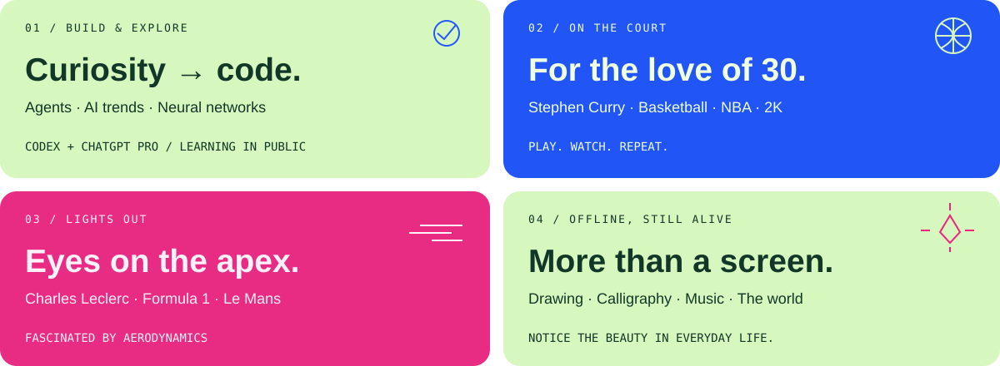
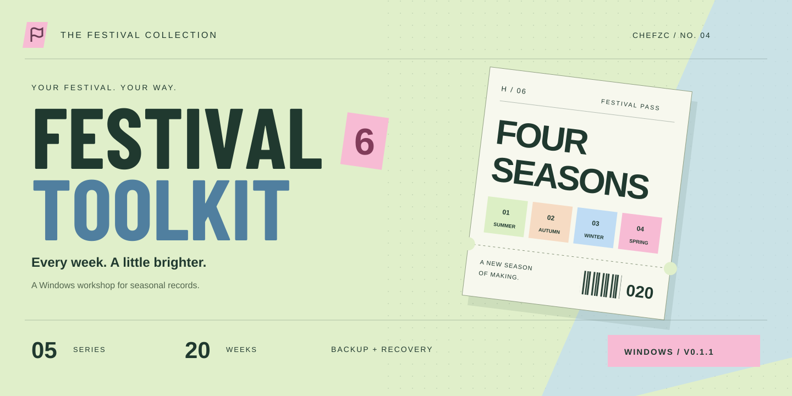
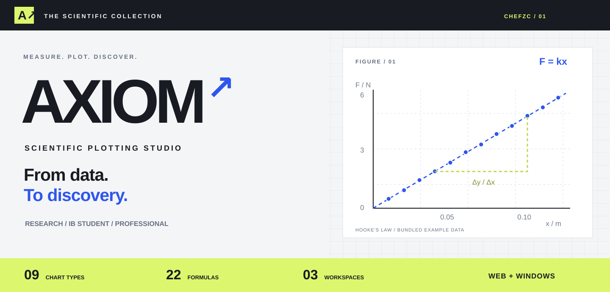
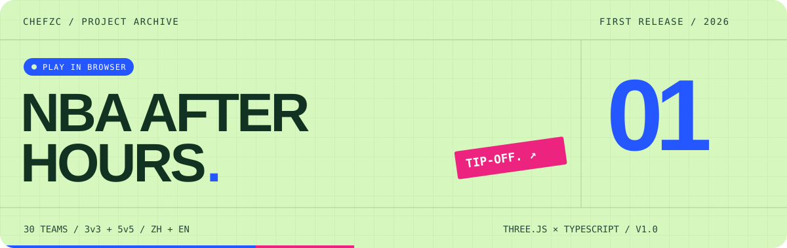

<b>English</b> · <a href="README.zh-CN.md">简体中文</a>

<a href="https://chefzc-homepage.vercel.app"><b>ENTER MY SPACE ↗</b></a> &nbsp; · &nbsp; <a href="https://chefzc-homepage.vercel.app/gallery.html">Gallery</a> &nbsp; · &nbsp; <a href="https://chefzc-homepage.vercel.app/posts.html">Posts</a> &nbsp; · &nbsp; <a href="https://chefzc-homepage.vercel.app/now.html">Now</a> &nbsp; · &nbsp; <a href="https://chefzc-homepage.vercel.app/profile.html#music">On repeat</a>

### `01` &nbsp; Hey, I'm ChefZC.

I'm a **Year 12 IB student** at **GEMS Wellington International School in Dubai**. I like experimenting with agents, learning about neural networks, following AI developments and exploring computer hardware. I'd love to become a computer engineer or work in aerodynamic design.

I'm drawn to distant places and the beauty of the world, but also to the good things right in front of me. Outside code, you'll find me on a basketball court, watching a race, drawing or practising calligraphy. Here to learn, build, and enjoy the journey.

### `02` &nbsp; Things I made.

**Horizon Festival Toolkit 0.1.1** — every week, a little brighter.

My fourth project: a Windows utility for FH6 seasonal records, selected-week edits, backup and recovery. Five series, twenty weeks, Chinese and English. A mint, blue and pink festival pass gives it a place in the Gallery. Encrypted saves use a third-party online service; in-game effects remain unverified.

[**WINDOWS ↓**](https://github.com/ChefDavid0815/horizon-festival-toolkit/releases/tag/v0.1.1) &nbsp; / &nbsp; [**SOURCE ↗**](https://github.com/ChefDavid0815/horizon-festival-toolkit) &nbsp; / &nbsp; [**GALLERY ↗**](https://chefzc-homepage.vercel.app/gallery.html#project-festival-toolkit) &nbsp; / &nbsp; [**POST ↗**](https://chefzc-homepage.vercel.app/post.html?article=festival-toolkit)

**AXIOM · Scientific plotting studio** — from data to discovery.

My third project: a scientific plotting and maths/physics workspace, built while studying the IB. Nine chart types, 22 formula calculators, regression and uncertainty tools, in Research, IB Student and Professional modes. Available in the browser, with data processed locally; also built for Windows. The current app UI is Chinese, with bilingual documentation.

[**OPEN AXIOM ↗**](https://chefzc-axiom.vercel.app) &nbsp; / &nbsp; [**SOURCE ↗**](https://github.com/ChefDavid0815/axiom-studio) &nbsp; / &nbsp; [**GALLERY ↗**](https://chefzc-homepage.vercel.app/gallery.html#project-axiom) &nbsp; / &nbsp; [**BUILD NOTES ↗**](https://chefzc-homepage.vercel.app/post.html?article=axiom)

**Folio 1.1 · Mod Studio** — a home for the things you love.

A quiet Windows studio for games and mods, built with Electron, React and TypeScript. Version 1.1 adds dedicated FH6 tools, a Nexus reading room and a version journal, while keeping the original NBA 2K27 resource organisation. Cream paper and terracotta give the practical work of organising files the feeling of turning a journal's pages.

Nexus currently uses a personal API key; SSO is unavailable. Live account/download flows and in-game compatibility remain unverified.

[**GET 1.1 ↓**](https://github.com/ChefDavid0815/folio-mod-studio/releases/tag/v1.1.0) &nbsp; / &nbsp; [**EXPLORE THE CODE ↗**](https://github.com/ChefDavid0815/folio-mod-studio) &nbsp; / &nbsp; [**VERSION JOURNAL ↗**](https://chefzc-homepage.vercel.app/gallery.html#folio-history)

#### My first released project.

**NBA After Hours** — a love for basketball, a court of my own.

A browser-based 3D arcade basketball game with 30 teams, cross-era lineups, a championship run, practice and challenges. Bring a friend for local two-player matches. Chinese and English, keyboard, controller and touch. Made with Three.js and TypeScript.

[**PLAY NOW ↗**](https://chefzc-homepage.vercel.app/play/nba-after-hours/) &nbsp; / &nbsp; [**EXPLORE THE CODE ↗**](https://github.com/ChefDavid0815/nba-after-hours) &nbsp; / &nbsp; [**THE EXHIBITION ↗**](https://chefzc-homepage.vercel.app/gallery.html#project-nba-after-hours)

Stephen Curry is my favourite basketball player; Charles Leclerc is my favourite racing driver. NBA, F1, Le Mans, playing basketball and 2K, drawing and calligraphy all have a place in my life.

### School lab / Ideas that take root.

**STRIDE · WIS TECH TANK 0.2.0** — a little awareness, a better next step.

A school presentation project with nine simulated walking environments, speech and haptic feedback, adjustable speed and a decision log. Optional local vision models explore real environment input. The website has a separate **School Lab** collection for classroom projects, with a natural green exhibition and an interactive field book. A classroom prototype, not a real-world navigation aid.

[**OPEN STRIDE ↗**](https://chefzc-wis-tech-tank.vercel.app) &nbsp; / &nbsp; [**SOURCE ↗**](https://github.com/ChefDavid0815/wis-tech-tank) &nbsp; / &nbsp; [**SCHOOL LAB ↗**](https://chefzc-homepage.vercel.app/school-gallery.html) &nbsp; / &nbsp; [**FIELD NOTES ↗**](https://chefzc-homepage.vercel.app/post.html?article=wis-tech-tank)

### `03` &nbsp; Currently in my world.

| Signal | What's happening |
| :--- | :--- |
| **WIS TECH TANK · STRIDE** | [School lab](https://chefzc-homepage.vercel.app/school-gallery.html): nine simulated environments, now on the web. |
| **Festival Toolkit 0.1.1** | Seasonal save workshop. Project four, for Windows. |
| **AXIOM 1.0** | [Scientific plotting studio](https://chefzc-axiom.vercel.app), now available on the web. |
| **Learning** | Neural networks, AI agents, and how to turn an idea into something real. |
| **Folio 1.1** | [Mod Studio](https://github.com/ChefDavid0815/folio-mod-studio), available as a Windows installer or portable app. |
| **Released** | [NBA After Hours](https://github.com/ChefDavid0815/nba-after-hours), my first project, playable online. |
| **Making** | [My personal space](https://chefzc-homepage.vercel.app): profile, real-project Gallery, Posts, a Now timeline and a record shelf. |
| **Dreaming** | Computer engineering or aerodynamic design. Two futures I'd love to explore. |
| **On repeat** | Joker Xue's《守村人》and Jay Chou's《七里香》. [Visit my record shelf ↗](https://chefzc-homepage.vercel.app/profile.html#music) |

Jay Chou · Joker Xue · G.E.M. · David Tao · Menni · Eason Chan · Vae Xu · Jane Zhang · JJ Lin

### `04` &nbsp; Small beginnings, real progress.

| Date | A page in the journal |
| :--- | :--- |
| **2026.09.19** | Published STRIDE for WIS TECH TANK and opened the School Lab collection. |
| **2026.09.18** | Published Festival Toolkit with its exhibition and build journal. |
| **2026.09.18** | Published AXIOM 1.0 on the web: scientific plotting, maths and physics. |
| **2026.09.18** | Released Folio 1.1: FH6, the Nexus reading room and version journal. |
| **2026.09.17** | Released Folio 1.0 and published the first three Posts. |
| **2026.09.17** | Released my first project, NBA After Hours. |
| **2026.09.17** | Added a music module: nine artists, 84 selected songs. |
| **2026.09.16** | Officially started building my personal website. |
| **2026.08.27** | Started the IB. |
| **2026.04.20** | Began exploring agents: a new direction for my curiosity. |

<b>⌘ My digital desk</b>

| Device | Configuration |
| :--- | :--- |
| ROG Strix G | RTX 5090 · 64 GB RAM · 2 TB |
| iPad Pro M4 | 512 GB |
| iPhone 15 Pro Max | 256 GB |
| Everyday tools | Codex · ChatGPT Pro |

### `05` &nbsp; Say hello.

AI, basketball, racing, or an interesting idea — I'd love to talk.

[**Email ↗**](mailto:zzichuan0808@outlook.com) &nbsp; / &nbsp; [**Instagram @chefzichuan ↗**](https://www.instagram.com/chefzichuan/) &nbsp; / &nbsp; [**My website ↗**](https://chefzc-homepage.vercel.app)

**Stay passionate. Keep loving life. Viva la vida.**

