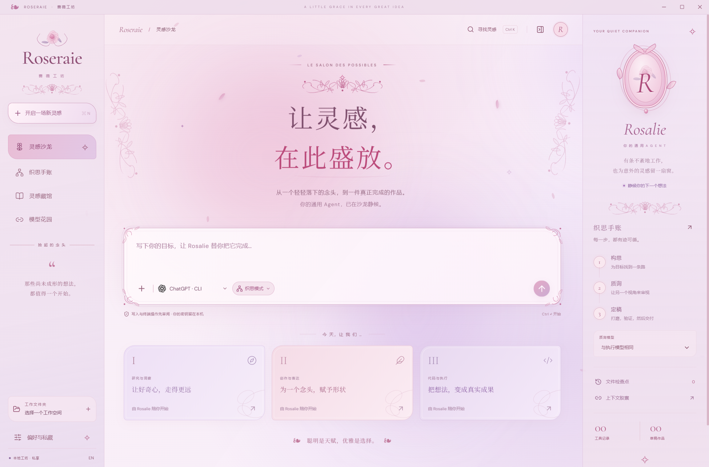
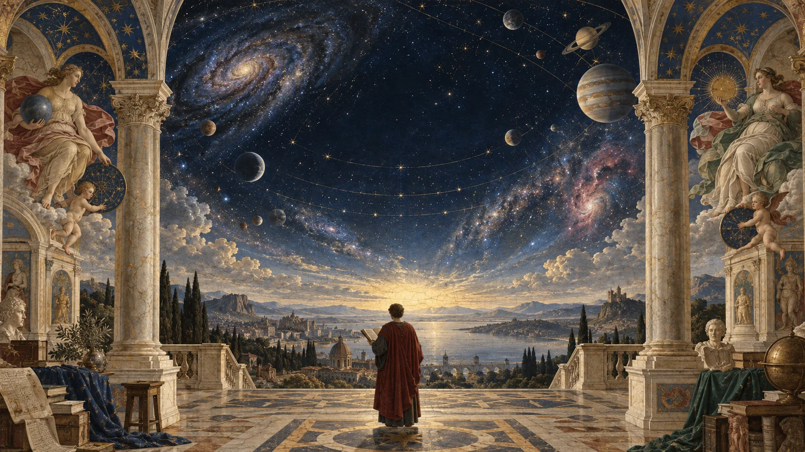
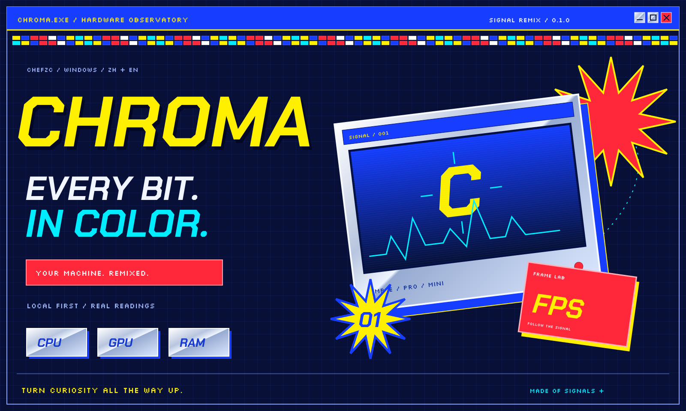
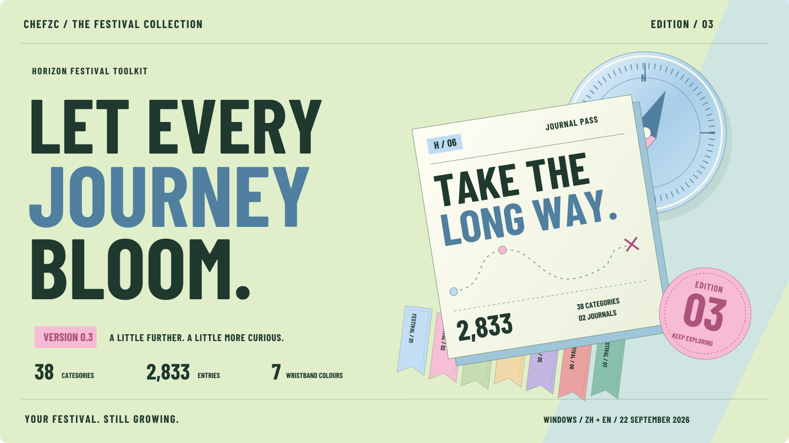
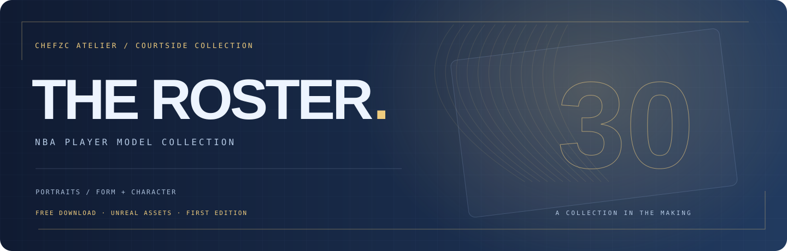

[English](README.md) · **简体中文**

<a href="https://chefzc.dev"></a>

<p align="center">
  <a href="https://chefzc.dev"><b>ENTER MY SPACE ↗</b></a> &nbsp; · &nbsp;
  <a href="https://chefzc.dev/gallery.html">Gallery / 作品</a> &nbsp; · &nbsp;
  <a href="https://chefzc.dev/posts.html">Posts / 随笔</a> &nbsp; · &nbsp;
  <a href="https://chefzc.dev/now.html">Now / 近况</a> &nbsp; · &nbsp;
  <a href="https://chefzc.dev/profile.html#music">On repeat / 音乐</a>
</p>

### `01` &nbsp; 你好，我是 ChefZC。

我是一名在迪拜 **GEMS Wellington International School** 读 IB 的 **Year 12 高中生**。喜欢动手折腾 Agent，正在学习神经网络，也一直关注 AI 与电脑硬件。未来，希望成为一名计算机工程师，或者空气动力学设计者。

我向往广阔的远方、世界的美景，也珍惜眼前的小小美好。在代码之外，你大概能在篮球场、F1 比赛前，或一张画纸旁找到我。

*An IB student in Dubai, exploring AI, agents and the ideas that might shape my future. Here to learn, build, and enjoy the journey — on the court, by the track, and beyond the screen.*


### `02` &nbsp; 我的作品

<a href="https://chefzc.dev/gallery.html#project-roseraie"></a>

**ROSERAIE 0.1.0 · 蔷薇工坊** — 让灵感，在此盛放。/ A little grace in every great idea.

一间给想法落地的 Windows 本地 Agent 工坊：工具调用、文件与命令确认、检查点、工作手记，以及「构思—质询—定稿」三阶段织思。玫瑰纸色的洛可可界面支持中英文。第一版通过 12 项测试、生产构建和 Windows 基本检查，也完成一次 Codex CLI 受控修复；其他服务与环境仍待测试，Windows 安装包尚未签名。

[**下载 WINDOWS 0.1.0 ↓**](https://github.com/ChefDavid0815/roseraie-agent/releases/tag/v0.1.0) &nbsp; / &nbsp; [**源码 · 中文 / EN ↗**](https://github.com/ChefDavid0815/roseraie-agent) &nbsp; / &nbsp; [**洛可可展柜 ↗**](https://chefzc.dev/gallery.html#project-roseraie) &nbsp; / &nbsp; [**工坊手记 ↗**](https://chefzc.dev/post.html?article=roseraie)

<a href="https://chefzc.dev/atlas/"></a>

**ATLAS 0.3 · IB 知识观星台** — 在思想之上，仰望无垠。/ Above every idea, a wider universe.

把学科之间的联系画成一片可以漫游的星空：784 个连通节点、1,059 条关联，原有 241 个主题全部有原创笔记。文艺复兴壁画、深蓝夜空、缓缓转动的轨道与手稿纸页，构成它自己的阅读空间。中文标题改用朱雀仿宋，正文采用霞鹜文楷 GB。网页和未签名的 Windows 版本都可体验；这是独立学习地图，并非官方或完整的 IB 考纲。

[**进入 ATLAS ↗**](https://chefzc.dev/atlas/) &nbsp; / &nbsp; [**源码 · 中文 / EN ↗**](https://github.com/ChefDavid0815/atlas-diploma-observatory) &nbsp; / &nbsp; [**文艺复兴展柜 ↗**](https://chefzc.dev/gallery.html#project-atlas) &nbsp; / &nbsp; [**观星手记 ↗**](https://chefzc.dev/post.html?article=atlas) &nbsp; / &nbsp; [**下载 0.3 ↓**](https://github.com/ChefDavid0815/atlas-diploma-observatory/releases/tag/v0.3.0)

<a href="https://chefzc.dev/gallery.html#project-chroma"></a>

**CHROMA 0.1.0 · 彩谱** — every bit, in color.

一座 Windows 本地硬件观测站。极简与专业模式、CPU / GPU、线程与传感器、十分钟趋势、会话导出和桌面置顶小窗。电光蓝、亮黄、信号红与银色金属，把千禧年的未来感搬进桌面。中英双语，读数留在本机；缺失数据保持为空。0.1.0 是未签名的早期版本，真实游戏内 FPS 与更多硬件仍待验证。

[**WINDOWS 下载 ↓**](https://github.com/ChefDavid0815/chroma-monitor/releases/tag/v0.1.0) &nbsp; / &nbsp; [**源代码 ↗**](https://github.com/ChefDavid0815/chroma-monitor) &nbsp; / &nbsp; [**千禧年展柜 ↗**](https://chefzc.dev/gallery.html#project-chroma) &nbsp; / &nbsp; [**信号手记 ↗**](https://chefzc.dev/post.html?article=chroma)

<a href="https://chefzc.dev/gallery.html#project-projectlens"></a>

**ProjectLens 0.1.0 · 项目透镜** — 把线索，放大。

一个 Windows 本地项目健康扫描器。读取代码、配置与文档，查看带文件位置、脱敏证据和建议的静态检查结果；按规则或文件检索，并导出 Markdown 或 JSON。默认本地处理，不调用远程 AI。中英双语界面与文档，可跟随系统或记住手动选择，扫描提示与导出跟随所选语言。当前是未签名的桌面 MVP，静态规则不能替代测试和安全审计。

[**下载 WINDOWS 版 ↓**](https://github.com/ChefDavid0815/projectlens/releases/tag/v0.1.0) &nbsp; / &nbsp; [**源代码 ↗**](https://github.com/ChefDavid0815/projectlens) &nbsp; / &nbsp; [**光学展柜 ↗**](https://chefzc.dev/gallery.html#project-projectlens) &nbsp; / &nbsp; [**制作手记 ↗**](https://chefzc.dev/post.html?article=projectlens)

<a href="https://chefzc.dev/gallery.html#project-festival-toolkit"></a>

**Horizon Festival Toolkit 0.3.0** — 让旅途，完整绽放。

旅程有了自己的手册：38 个分类、2,833 个收藏项目、七色腕带与每日 GitHub 版本提醒。647 车型车库、四季工坊、中英文界面与备份恢复继续保留。薄荷绿、淡蓝与粉色的指南针通行证，收藏第三次出发。腕带持有不等于剧情解锁；加密存档使用第三方服务，游戏内效果尚未验证。

[**WINDOWS ↓**](https://github.com/ChefDavid0815/horizon-festival-toolkit/releases/tag/v0.3.0) &nbsp; / &nbsp; [**SOURCE ↗**](https://github.com/ChefDavid0815/horizon-festival-toolkit) &nbsp; / &nbsp; [**GALLERY ↗**](https://chefzc.dev/gallery.html#project-festival-toolkit) &nbsp; / &nbsp; [**VERSION JOURNAL ↗**](https://chefzc.dev/gallery.html#festival-history) &nbsp; / &nbsp; [**POST ↗**](https://chefzc.dev/post.html?article=festival-toolkit)

<a href="https://chefzc.dev/axiom/"></a>

**AXIOM · 格物** — 让数据，形成观点。

我的第三件作品，也是在 IB 学习路上为自己做的一件工具。九种图表、22 条可计算公式、拟合与误差分析，配合研究、IB 学生和专业三种模式。网页版数据本地处理，也有 Windows 版本。冷白、墨黑、荧光黄绿与钴蓝，是它自己的科学气质。

[**打开 AXIOM ↗**](https://chefzc.dev/axiom/) &nbsp; / &nbsp; [**探索源码 ↗**](https://github.com/ChefDavid0815/axiom-studio) &nbsp; / &nbsp; [**GALLERY ↗**](https://chefzc.dev/gallery.html#project-axiom) &nbsp; / &nbsp; [**制作手记 ↗**](https://chefzc.dev/post.html?article=axiom)

<a href="https://chefzc.dev/gallery.html#project-folio"></a>

**Folio 1.1 · 模组手帖** — 为热爱，留一席之地。

一间安静的 Windows 游戏与模组收藏工作室。1.1 新增 FH6 专项适配、Nexus 书房与版本手记，保留原有 NBA 2K27 资源归档。奶油纸、陶土橙与出版物式排版，让整理文件也有翻阅手帖的心情。Nexus 使用个人 API Key；SSO 尚未开放，真实账号、线上下载与游戏内兼容性待验证。

*A Windows mod studio built with Electron, React and TypeScript. My second released project, made for the games I love.*

[**下载 1.1 ↓**](https://github.com/ChefDavid0815/folio-mod-studio/releases/tag/v1.1.0) &nbsp; / &nbsp; [**探索源码 ↗**](https://github.com/ChefDavid0815/folio-mod-studio) &nbsp; / &nbsp; [**版本更新历程 ↗**](https://chefzc.dev/gallery.html#folio-history)

#### First release / 我的第一个项目

<a href="https://chefzc.dev/play/nba-after-hours/"></a>

**NBA After Hours / 决胜时刻** — 把对篮球的热爱，做成一座自己的球场。

浏览器里的 3D 街机篮球：30 支球队、跨时代阵容、冠军征程、训练与挑战，也能和朋友同机对战。支持中英文、键盘、手柄与触屏。

*My first released project. Built with Three.js and TypeScript. Play a quick game, chase a championship, or bring a friend for local two-player basketball.*

[**立即上场 · PLAY NOW ↗**](https://chefzc.dev/play/nba-after-hours/) &nbsp; / &nbsp; [**探索源码 ↗**](https://github.com/ChefDavid0815/nba-after-hours) &nbsp; / &nbsp; [**Gallery 展位 ↗**](https://chefzc.dev/gallery.html#project-nba-after-hours)

我最喜欢的篮球球星是斯蒂芬·库里，最喜欢的车手是夏尔·勒克莱尔。看 NBA、F1 和勒芒，打篮球、玩 2K、画画和写书法，都是生活里不可少的快乐。

### 建模的作品 / 热爱，就要立体出场！

<a href="https://chefzc.dev/models-gallery.html#project-chase-center"></a>

**NBA 球馆建模作品** — 首件收藏：大通中心。

蓝黄撞色、漫画网点和动态玻璃展柜，组成独立的球馆作品库。大通中心的内景与外景，拥有两只可切换、可拖动旋转的 3D 玻璃盒。完整 Blender 模型、Unreal 可导入的 FBX 与必要材质以免费版本包提供。之后继续加入不同球馆。

[**3D 展柜 ↗**](https://chefzc.dev/models-gallery.html#project-chase-center) · [**作品库 ↗**](https://github.com/ChefDavid0815/nba-arena-models) · [**免费下载 ↓**](https://github.com/ChefDavid0815/nba-arena-models/releases/tag/v0.1.0)

<a href="https://chefzc.dev/models-gallery.html#project-curry-head"></a>

**NBA 球员建模作品** — 首件收藏：Stephen Curry 脸模。

玫红与钴蓝的人物收藏卡，持续收录不同球员。库里脸模基于购入的第三方 MNJ Mod 整理与适配，包含脸部、毛发、眼睛与口腔部件。当前是角色头部原型，尚无完整表情系统。免费下载不改变第三方素材的权利与原有条款。

[**3D 展柜 ↗**](https://chefzc.dev/models-gallery.html#project-curry-head) · [**作品库 ↗**](https://github.com/ChefDavid0815/nba-player-models) · [**免费下载 ↓**](https://github.com/ChefDavid0815/nba-player-models/releases/tag/v0.1.0) · [**建模手记 ↗**](https://chefzc.dev/post.html?article=courtside-collection)

### 校园实验室 / 让想法，慢慢生长。

<a href="https://chefzc.dev/school-gallery.html"></a>

**STRIDE · WIS TECH TANK 0.2.0** — 感知多一点，下一步更从容。

为学校展示制作的环境感知原型：九种模拟场景、语音与振动反馈、行走速度调节，还有可以翻看的判断记录。可选本地视觉模型用于探索真实环境输入。个人网站新开了独立的**校园实验室**分页，用森林绿与纸张白做成自然主题展柜，也放进了一本可以切换场景的观察手记。课堂概念原型，不用于现实导航。

[**打开 STRIDE ↗**](https://chefzc.dev/stride/) &nbsp; / &nbsp; [**探索源码 ↗**](https://github.com/ChefDavid0815/wis-tech-tank) &nbsp; / &nbsp; [**校园实验室 ↗**](https://chefzc.dev/school-gallery.html) &nbsp; / &nbsp; [**观察手记 ↗**](https://chefzc.dev/post.html?article=wis-tech-tank)

### `03` &nbsp; 最近的世界

| 信号 | 正在发生 |
| :--- | :--- |
| **ATLAS 0.3** | [IB 知识观星台](https://chefzc.dev/atlas/)上线，文艺复兴星空、双语笔记与新[展柜](https://chefzc.dev/gallery.html#project-atlas)开放。 |
| **CHROMA 0.1.0** | 本地硬件观测站、[千禧年信号展柜](https://chefzc.dev/gallery.html#project-chroma)与双语制作手记。 |
| **ProjectLens 0.1.0** | 中英双语本地项目健康扫描器、[光学展柜](https://chefzc.dev/gallery.html#project-projectlens)与新的制作手记。 |
| **WIS TECH TANK · STRIDE** | [校园实验室](https://chefzc.dev/school-gallery.html)开放，九种模拟环境已上线。 |
| **Festival Toolkit 0.3.0** | 旅程收藏手册、七色腕带、每日版本提醒与 647 车型车库。 |
| **AXIOM 1.0** | [格物](https://chefzc.dev/axiom/) — 科学绘图与数学物理工作台，网页版已上线。 |
| 🧠 **学习** | 神经网络、AI Agent，以及把想法做出来的能力。 |
| 🗂️ **Folio 1.1** | [模组手帖](https://github.com/ChefDavid0815/folio-mod-studio) — Windows 安装版与免安装版。 |
| 🏀 **已发布** | [NBA After Hours](https://github.com/ChefDavid0815/nba-after-hours) — 第一个正式项目，已可在线游玩。 |
| 🛠️ **创造** | [我的个人主页](https://chefzc.dev) — 个人介绍、真实项目 Gallery、Posts 随笔、Now 时间线与私人唱片架。 |
| 🏁 **向往** | 计算机工程师 / 空气动力学设计者。两条都让我心动的未来方向。 |
| 🎧 **循环播放** | 薛之谦《守村人》、周杰伦《七里香》。[逛逛我的音乐宇宙 ↗](https://chefzc.dev/profile.html#music) |

周杰伦 · 薛之谦 · 邓紫棋 · 陶喆 · 门尼 · 陈奕迅 · 许嵩 · 张靓颖 · 林俊杰

### `04` &nbsp; 小小开始，认真向前

```text
2026.09.23  ──  发布 Atlas 0.3：知识观星台、文艺复兴展柜与中英双语观星手记。
2026.09.22  ──  CHROMA 0.1.0：本地硬件观测站、千禧年信号展柜与双语随笔。
2026.09.22  ──  Festival Toolkit 0.3：旅程手册、七色腕带与每日更新提醒。
2026.09.21  ──  ProjectLens 0.1.0：本地项目透镜、光学展柜与新的制作手记。
2026.09.20  ──  开放建模展厅：大通中心内外景、库里脸模与两个独立模型作品库。
2026.09.20  ──  Festival Toolkit 0.2：车辆收藏、内容更新与版本手记。
2026.09.19  ──  WIS TECH TANK · STRIDE 上线，校园实验室展厅开放。
2026.09.18  ──  Festival Toolkit 加入作品集，同步四季展柜与制作手记。
2026.09.18  ──  AXIOM · 格物网页版上线：让数据，形成观点。
2026.09.18  ──  发布 Folio 1.1：FH6、Nexus 书房与版本手记。
2026.09.17  ──  发布 Folio 1.0；Posts 写下首批三篇随笔。
2026.09.17  ──  发布第一个正式项目：NBA After Hours。
2026.09.17  ──  给主页加入音乐模块：9 位歌手，84 首精选。
2026.09.16  ──  正式创造自己的个人主页。
2026.08.27  ──  正式步入 IB。
2026.04.20  ──  开始接触 Agents，好奇心有了新的方向。
```

<details>
<summary><b>⌘ My digital desk / 我的数字工作台</b></summary>

| 设备 | 配置 |
| :--- | :--- |
| ROG Strix G | RTX 5090 · 64 GB RAM · 2 TB |
| iPad Pro M4 | 512 GB |
| iPhone 15 Pro Max | 256 GB |
| 常用工具 | Codex · ChatGPT Pro |

</details>

### `05` &nbsp; 打个招呼

聊 AI、篮球、赛车，或者一个有意思的新想法。

[**Email ↗**](mailto:zzichuan0808@outlook.com) &nbsp; / &nbsp; [**Instagram @chefzichuan ↗**](https://www.instagram.com/chefzichuan/) &nbsp; / &nbsp; [**My website ↗**](https://chefzc.dev)


